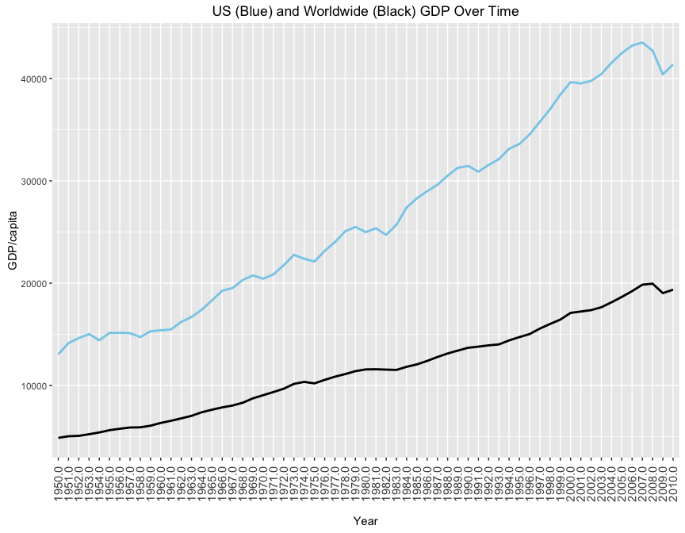

# GDP Analysis
Stacey Lee  
April 1, 2016  
### Load libraries and data

```r
library(ggplot2)
```

```
## Warning: package 'ggplot2' was built under R version 3.1.3
```

```r
library(dplyr)
```

```
## Warning: package 'dplyr' was built under R version 3.1.3
```

```
## 
## Attaching package: 'dplyr'
```

```
## The following objects are masked from 'package:stats':
## 
##     filter, lag
```

```
## The following objects are masked from 'package:base':
## 
##     intersect, setdiff, setequal, union
```

```r
library(plyr)
```

```
## Warning: package 'plyr' was built under R version 3.1.3
```

```
## -------------------------------------------------------------------------
```

```
## You have loaded plyr after dplyr - this is likely to cause problems.
## If you need functions from both plyr and dplyr, please load plyr first, then dplyr:
## library(plyr); library(dplyr)
```

```
## -------------------------------------------------------------------------
```

```
## 
## Attaching package: 'plyr'
```

```
## The following objects are masked from 'package:dplyr':
## 
##     arrange, count, desc, failwith, id, mutate, rename, summarise,
##     summarize
```

```r
library(tidyr)
```

```
## Warning: package 'tidyr' was built under R version 3.1.3
```

```r
library(readxl)
```

```
## Warning: package 'readxl' was built under R version 3.1.3
```

```r
df <- read_excel("/Users/staceylee/Desktop/GitHub/Gapminder-Datasets/indicator\ GDP.xlsx")
```

### Clean up the data

```r
df_clean <- na.omit(df)
df_clean <- rename(df_clean, c("pwt 7.1 rgdpl" = "Countries"))
df_clean <- gather(df_clean, "year", "gdp", 2:62)
```

### Plot GDP by country in 1950

```r
df1950 <- filter(df_clean, year == "1950.0") 

ggplot(aes(x = Countries, y = gdp), data = df1950) + geom_bar(stat = "identity") + 
  theme(axis.text.x=element_text(angle = 90, hjust = 1, 
                                 vjust = 0.5, size = 11, margin=margin(5,5,10,5,"pt"))) + 
  labs(title = "GDP in 1950", y = "GDP/capita")
```

<!-- -->

### Plot GDP by country in 2010

```r
df2010 <- filter(df_clean, year == "2010.0")

ggplot(aes(x = Countries, y = gdp), data = df2010) + geom_bar(stat = "identity") + 
  theme(axis.text.x=element_text(angle = 90, hjust = 1, 
                                 vjust = 0.5, size = 11, margin=margin(5,5,10,5,"pt"))) + 
  labs(title = "GDP in 2010", y = "GDP/capita")
```

<!-- -->

### Plot GDP by country by year

```r
both <- filter(df_clean, year == "1950.0" | year == "2010.0")
  
ggplot(aes(x = Countries, y = gdp, color = year), data = both) + geom_bar(stat = "identity") + 
  theme(axis.text.x=element_text(angle = 90, hjust = 1, 
                                 vjust = 0.5, size = 11, margin=margin(5,5,10,5,"pt"))) + 
  labs(title = "GDP in 1950 vs 2010", y = "GDP/capita")
```

<!-- -->

### Plot total GDP by year

```r
totaldf <- na.omit(df)
totaldf <- rename(totaldf, c("pwt 7.1 rgdpl" = "Countries"))
totaldf <- select(totaldf, -Countries)
totaldfsum <- summarise_each(totaldf, funs(mean))
totaldfsum <- gather(totaldfsum, "year", "mean_gdp", 1:61)
USsum <- filter(df_clean, Countries == "United States")
  
ggplot() + geom_line(aes(x = year, y = mean_gdp, group = 1), color = "black", size = 1, 
                     data = totaldfsum) + 
  geom_line(aes(x = year, y = gdp, group = 1, label = "US"), color = "sky blue", size = 1, data = USsum) +
  theme(axis.text.x=element_text(angle = 90, hjust = 1, 
                                 vjust = 0.5, size = 11, margin=margin(5,5,10,5,"pt"))) +
  labs(title = "US (Blue) and Worldwide (Black) GDP Over Time", x = "Year", y = "GDP/capita")
```

<!-- -->

